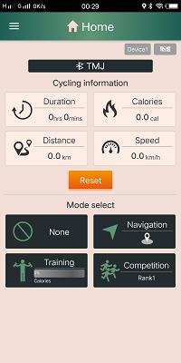
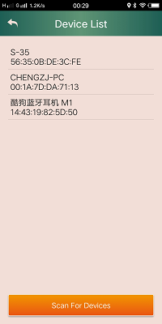

# todo-bluetooth-wtmj
一个蓝牙的app，使用谷歌地图。

## 声明
该项目仅供技术研究参考，禁止一切商业目的的使用。

## 效果图

                              

## License

    Copyright 2018 cheng2016,Inc.

    Licensed under the Apache License, Version 2.0 (the "License");
    you may not use this file except in compliance with the License.
    You may obtain a copy of the License at

    http://www.apache.org/licenses/LICENSE-2.0

    Unless required by applicable law or agreed to in writing, software
    distributed under the License is distributed on an "AS IS" BASIS,
    WITHOUT WARRANTIES OR CONDITIONS OF ANY KIND, either express or implied.
    See the License for the specific language governing permissions and
    limitations under the License.
